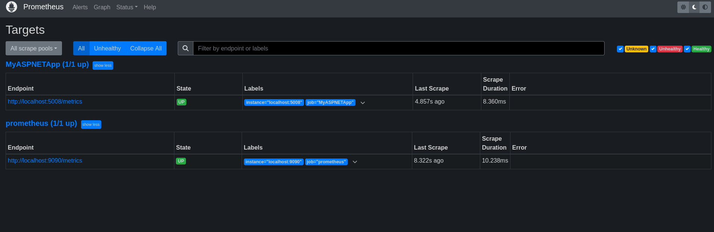

# Coletando méricas
## Tecnologias utilizadas

- .NET Core 8.0
- Prometheus
- Grafana
- OpenTelemetry
- Docker
## Coleta de métricas

### Criando projeto .NET Core
Para coletar métricas, precisamos de um projeto .NET Core. Criei uma aplicação web usando os comandos:

```bash
dotnet new web -o WebMetric
cd WebMetric
dotnet add package OpenTelemetry.Exporter.Prometheus.AspNetCore --prerelease
dotnet add package OpenTelemetry.Extensions.Hosting
```
E no arquivo `Program.cs`, substitua o código por:

```csharp
using OpenTelemetry.Metrics;

var builder = WebApplication.CreateBuilder(args);
builder.Services.AddOpenTelemetry()
    .WithMetrics(builder =>
    {
        builder.AddPrometheusExporter();

        builder.AddMeter("Microsoft.AspNetCore.Hosting",
                         "Microsoft.AspNetCore.Server.Kestrel");
        builder.AddView("http.server.request.duration",
            new ExplicitBucketHistogramConfiguration
            {
                Boundaries = new double[] { 0, 0.005, 0.01, 0.025, 0.05,
                       0.075, 0.1, 0.25, 0.5, 0.75, 1, 2.5, 5, 7.5, 10 }
            });
    });
var app = builder.Build();

app.MapPrometheusScrapingEndpoint();

app.MapGet("/", () => "Hello OpenTelemetry! ticks:"
                     + DateTime.Now.Ticks.ToString()[^3..]);

app.Run();
```

### Exibir métricas com dotnet-counters

Instale a ferramenta `dotnet-counters` com o comando:

```bash
dotnet tool update -g dotnet-counters
```

Execute a aplicação com o comando:

```bash
dotnet run
```

E em outro terminal, execute o comando:

```bash
dotnet-counters monitor -n WebMetric --counters Microsoft.AspNetCore.Hosting
```

Você pode testar a aplicação acessando `http://localhost:5008/` e ver as métricas no terminal.


### Enriquencendo métricas

O ASP.NET Core tem muitas métricas internas. A métrica http.server.request.duration:

- Registra a duração das solicitações HTTP no servidor.
- Captura informações da solicitação em marcas, como a rota correspondente e o código do status da resposta.

Enriquecimento é quando uma biblioteca ou aplicativo adiciona suas próprias marcas a uma métrica. Isso será útil se um aplicativo desejar adicionar uma categorização personalizada a painéis ou alertas criados com métricas.

Substitua o código do arquivo `Program.cs` por:

```csharp
using Microsoft.AspNetCore.Http.Features;

var builder = WebApplication.CreateBuilder();
var app = builder.Build();

app.Use(async (context, next) =>
{
    var tagsFeature = context.Features.Get<IHttpMetricsTagsFeature>();
    if (tagsFeature != null)
    {
        var source = context.Request.Query["utm_medium"].ToString() switch
        {
            "" => "none",
            "social" => "social",
            "email" => "email",
            "organic" => "organic",
            _ => "other"
        };
        tagsFeature.Tags.Add(new KeyValuePair<string, object?>("mkt_medium", source));
    }

    await next.Invoke();
});

app.MapGet("/", () => "Hello World!");

app.Run();
```

Agora, ao acessar `http://localhost:5008/', você verá as métricas enriquecidas no terminal.


### Criando métricas personalizadas

Agora, é necessário criar uma nova classe chamada ContosoMetrics, em um novo arquivo chamado ContosoMetrics.cs:

```csharp
public class ContosoMetrics
{
    private readonly Counter<int> _productSoldCounter;

    public ContosoMetrics(IMeterFactory meterFactory)
    {
        var meter = meterFactory.Create("Contoso.Web");
        _productSoldCounter = meter.CreateCounter<int>("contoso.product.sold");
    }

    public void ProductSold(string productName, int quantity)
    {
        _productSoldCounter.Add(quantity,
            new KeyValuePair<string, object?>("contoso.product.name", productName));
    }
}
```

Essa classe cria um contador chamado contoso.product.sold, que registra a quantidade de produtos vendidos. Ele também registra o nome do produto vendido.
Para coletar essas métricas, modifique o arquivo Program.cs:

```csharp
using WebMetric;
using WebMetric.Models;

var builder = WebApplication.CreateBuilder(args);

builder.Services.AddSingleton<ContosoMetrics>();

var app = builder.Build();

app.MapPost("/complete-sale", (SaleModel model, ContosoMetrics metrics) =>
{
    metrics.ProductSold(model.ProductName, model.QuantitySold);
});

app.Run();
```

E para modularizar o código, crie um novo arquivo chamado Models/SaleModel.cs:

```csharp
namespace WebMetric.Models;

public class SaleModel
{
    public string ProductName { get; set; }
    public int QuantitySold { get; set; }
}
```
Após essas alterações, use o comando abaixo para monitorar as métricas personalizadas, após iniciar a aplicação com `dotnet run`:

```bash
dotnet-counters monitor -n WebMetric --counters Contoso.Web
```

Faça uma requisição POST para `http://localhost:5008/complete-sale` com o corpo:

```json
{
    "productName": "Laptop",
    "quantitySold": 10
}
```

Dessa forma, você verá as métricas personalizadas no terminal.


## Visualizando métricas com Grafana e Prometheus

### Substituindo o código do Program.cs

Para essa parte, substitua o código do arquivo Program.cs por:

```csharp
using OpenTelemetry.Metrics;

var builder = WebApplication.CreateBuilder(args);
builder.Services.AddOpenTelemetry()
    .WithMetrics(builder =>
    {
        builder.AddPrometheusExporter();

        builder.AddMeter("Microsoft.AspNetCore.Hosting",
            "Microsoft.AspNetCore.Server.Kestrel");
        builder.AddView("http.server.request.duration",
            new ExplicitBucketHistogramConfiguration
            {
                Boundaries = new double[] { 0, 0.005, 0.01, 0.025, 0.05,
                    0.075, 0.1, 0.25, 0.5, 0.75, 1, 2.5, 5, 7.5, 10 }
            });
    });
var app = builder.Build();

app.MapPrometheusScrapingEndpoint();

app.MapGet("/", () => "Hello OpenTelemetry! ticks:"
                      + DateTime.Now.Ticks.ToString()[^3..]);

app.Run();

```
É possível ver as métricas no navegador acessando `http://localhost:5008/metrics`.


### Executando Prometheus e Grafana
Para facilitar a execução do Prometheus e Grafana, crie um arquivo chamado docker-compose.yml com o seguinte conteúdo:

```yaml
services:
  prometheus:
    image: prom/prometheus
    network_mode: "host"
    container_name: prometheus
    volumes:
      - ./prometheus:/etc/prometheus
  
  grafana:
    image: grafana/grafana
    network_mode: "host"
    container_name: grafana
```

Além desse arquivo, deve se criar um arquivo de configuração para o Prometheus, chamado prometheus.yml, com o seguinte conteúdo:

```yaml
# my global config
global:
  scrape_interval: 15s # Set the scrape interval to every 15 seconds. Default is every 1 minute.
  evaluation_interval: 15s # Evaluate rules every 15 seconds. The default is every 1 minute.
  # scrape_timeout is set to the global default (10s).

# Alertmanager configuration
alerting:
  alertmanagers:
    - static_configs:
        - targets:
          # - alertmanager:9093

# Load rules once and periodically evaluate them according to the global 'evaluation_interval'.
rule_files:
  # - "first_rules.yml"
  # - "second_rules.yml"

# A scrape configuration containing exactly one endpoint to scrape:
# Here it's Prometheus itself.
scrape_configs:
  # The job name is added as a label `job=<job_name>` to any timeseries scraped from this config.
  - job_name: "prometheus"

    # metrics_path defaults to '/metrics'
    # scheme defaults to 'http'.

    static_configs:
      - targets: ["localhost:9090"]

  - job_name: 'MyASPNETApp'
    scrape_interval: 5s # Poll every 5 seconds for a more responsive demo.
    static_configs:
      - targets: ["localhost:5008"]  ## Enter the HTTP port number of the demo app.
```

Agora basta subir os containers com o comando:

```bash
docker-compose up
```


### Coletando métricas com Prometheus

Para coletar métricas com Prometheus, acesse `http://localhost:9090/`, clique em Status e depois em Targets. Você verá a conexão com o MyASPNETApp.



Nesse caso, foi selecionada a métrica `http_server_request_duration_seconds_count`. Para visualizar a métrica, clique em Graph e insira a métrica no campo de busca.


### Visualizando métricas com Grafana

Para visualizar as métricas com Grafana, acesse `http://localhost:3000/` e faça login com o usuário admin e senha admin.

Após logar no Grafana, clique em 'Connections', depois em 'Add a new connection' e selecione Prometheus.


Em seguida, clique em 'Add new data source' e insira o nome do data source, selecione Prometheus e insira a URL do Prometheus, que nesse caso é `http://localhost:9090`.


Para finalizar a conexão, clique em 'Save & Test'.

### Criando um dashboard

Para criar um dashboard, volte para o menu principal, clique em 'Dashboards' e depois em 'Create dashboard'.

Após isso, clique em 'Import dashboard' para usar um template de visualização.
Baixe o template em [https://grafana.com/api/dashboards/19924/revisions/4/download](https://grafana.com/api/dashboards/19924/revisions/4/download), e faça a importação dele no Grafana.

Não se esqueça de selecionar o data source que foi criado anteriormente.


O dashboard será exibido com as métricas coletadas.


